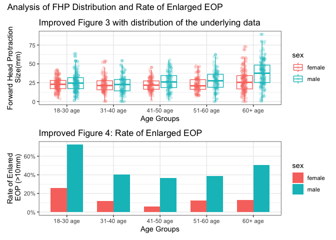
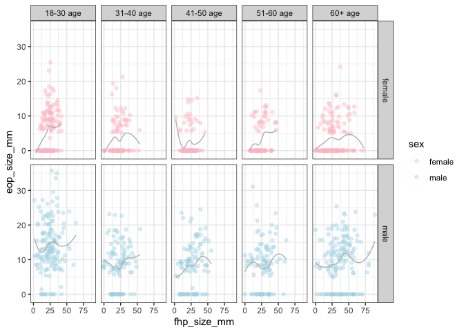

p8105_mtp_hc3654
================

``` r
library(tidyverse)
```

    ## ── Attaching core tidyverse packages ──────────────────────── tidyverse 2.0.0 ──
    ## ✔ dplyr     1.1.4     ✔ readr     2.1.5
    ## ✔ forcats   1.0.0     ✔ stringr   1.5.1
    ## ✔ ggplot2   3.5.2     ✔ tibble    3.3.0
    ## ✔ lubridate 1.9.4     ✔ tidyr     1.3.1
    ## ✔ purrr     1.1.0     
    ## ── Conflicts ────────────────────────────────────────── tidyverse_conflicts() ──
    ## ✖ dplyr::filter() masks stats::filter()
    ## ✖ dplyr::lag()    masks stats::lag()
    ## ℹ Use the conflicted package (<http://conflicted.r-lib.org/>) to force all conflicts to become errors

``` r
library(readxl)
library(patchwork)
```

\#Problem 1 – Data.

``` r
eop_df_raw <-  read_excel("p8105_mtp_data.xlsx", skip = 8, sheet = 1, na = c("NA",".", "")) |> 
  janitor::clean_names()
```

Clean data

``` r
eop_df_clean <- eop_df_raw |> 
  mutate(
    sex = case_when(
      sex == 1 ~ "male",
      sex == 0 ~ "female"
    ), 
    sex = factor(sex),
    eop_size_mm = case_when(
      !is.na(eop_size_mm) ~ eop_size_mm,  
  is.na(eop_size_mm)  ~ 0
    ),

    age_group = case_when(
      age_group == 2 ~ "18-30 age",
      age_group == 3 ~"31-40 age" ,
      age_group == 4 ~ "41-50 age",
      age_group == 5 ~ "51-60 age",
      age_group %in% c(6,7,8) ~"60+ age"
    ),
    age_group = factor(age_group, 
                       levels = c("18-30 age", "31-40 age", "41-50 age", "51-60 age", "60+ age"),
                       ordered = TRUE),
    eop_size = case_when( 
      eop_size == 0 ~ "0-5mm eop size",
      eop_size == 1 ~ "5-10mm eop size",
      eop_size == 2 ~ "10-15mm eop size",
      eop_size == 3 ~ "15-20mm eop size",
      eop_size == 4 ~ "20-25mm eop size",
      eop_size == 5 ~ "25+mm eop size"
    ),
   eop_size = factor(eop_size,
                      levels = c("0-5mm eop size", "5-10mm eop size", "10-15mm eop size", "15-20mm eop size", "20-25mm eop size", "25+mm eop size"),
                      ordered = TRUE),
    eop_visibility_classification = case_when(
      eop_visibility_classification == 0 ~ "eop size mm <= 5",
      eop_visibility_classification == 1 ~ "0 < eop size mm <= 5",
      eop_visibility_classification == 2 ~ "eop size mm >= 5"
    ),
    eop_visibility_classification = factor(eop_visibility_classification),
    fhp_category = case_when(
      fhp_category == 0 ~ "0mm-10mm",
      fhp_category == 1 ~ "10mm-20mm",
      fhp_category == 2 ~ "20mm-30mm",
    ! (fhp_category %in% c(0, 1, 2)) ~ "other"
    ),
    fhp_category = factor(fhp_category)
    )
```

``` r
eop_df_clean |> 
  mutate(
    eop_size_check = case_when(
      eop_size_mm >= 0 & eop_size_mm <= 5 ~ "0-5mm eop size",
      eop_size_mm > 5 & eop_size_mm <= 10 ~ "5-10mm eop size",
      eop_size_mm > 10 & eop_size_mm <= 15 ~ "10-15mm eop size",
      eop_size_mm > 15 & eop_size_mm <= 20 ~ "15-20mm eop size",
      eop_size_mm > 20 & eop_size_mm <= 25 ~ "20-25mm eop size",
      eop_size_mm > 25 ~ "25+mm eop size"
    )) |> 
  filter(eop_size != eop_size_check) |> 
  select(sex, age, eop_size_mm, eop_size, eop_size_check) |> 
  head(5) |> 
  knitr::kable(caption = "Examples of category and value are differents")
```

| sex    | age | eop_size_mm | eop_size         | eop_size_check |
|:-------|----:|------------:|:-----------------|:---------------|
| male   |  21 |       33.50 | 20-25mm eop size | 25+mm eop size |
| female |  27 |       25.50 | 20-25mm eop size | 25+mm eop size |
| male   |  22 |       35.00 | 20-25mm eop size | 25+mm eop size |
| male   |  21 |       29.50 | 20-25mm eop size | 25+mm eop size |
| male   |  18 |        2.11 | 20-25mm eop size | 0-5mm eop size |

Examples of category and value are differents

\#Problem 2:

\##Figure 3:

``` r
new_figured_3 <- 
eop_df_clean |> 
  drop_na(fhp_size_mm, age_group) |> 
  ggplot(aes(x = age_group, y = fhp_size_mm, color = sex))+
  geom_boxplot(alpha = 0.3)+
  geom_jitter(position = position_jitterdodge(dodge.width = 0.8, jitter.width = 0.2), alpha = 0.2)+
  labs(title="Improved Figure 3 with distribution of the underlying data", x = "Age Groups", y = "Forward Head Protraction\n Size(mm)")+
  theme_bw()
```

\##Figure 4:

``` r
eeop_age_sex_rate <- 
eop_df_clean |> 
  drop_na(age_group, eop_size_mm, sex) |> 
  mutate(eeop = case_when(
    eop_size_mm > 10 ~ 1,
    eop_size_mm <= 10 ~ 0
  )) |> 
  select(sex, age_group, eop_size_mm, eeop) |> 
  group_by(age_group, sex) |> 
  summarise(eeop_rate = mean(eeop == 1, na.rm = TRUE), .groups = "drop")
eeop_age_sex_rate
```

    ## # A tibble: 10 × 3
    ##    age_group sex    eeop_rate
    ##    <ord>     <fct>      <dbl>
    ##  1 18-30 age female    0.258 
    ##  2 18-30 age male      0.724 
    ##  3 31-40 age female    0.118 
    ##  4 31-40 age male      0.402 
    ##  5 41-50 age female    0.0566
    ##  6 41-50 age male      0.366 
    ##  7 51-60 age female    0.121 
    ##  8 51-60 age male      0.386 
    ##  9 60+ age   female    0.129 
    ## 10 60+ age   male      0.507

``` r
new_figured_4 <- eeop_age_sex_rate |> 
  ggplot(aes(x = age_group, y = eeop_rate, fill = sex))+
  geom_bar(stat = "identity", position = "dodge", width = 0.7)+
  scale_y_continuous(labels = scales::percent) +
  labs(title = "Improved Figure 4: Rate of Enlarged EOP", 
       x = "Age Groups",
       y = "Rate of Enlared\n EOP (>10mm)")+
  theme_bw()
```

``` r
(new_figured_3/new_figured_4)+
   plot_annotation(
    title = "Analysis of FHP Distribution and Rate of Enlarged EOP")
```

<!-- -->

# 2 x 5 collection of panels

``` r
eop_df_clean |> 
  drop_na(fhp_size_mm, eop_size_mm, age_group, sex) |> 
  ggplot(aes(x = fhp_size_mm, y= eop_size_mm, color = sex))+
  geom_point( alpha = 0.4)+
  scale_color_manual(values = c("pink", "lightblue"))+
  geom_smooth(se = FALSE, color = "grey", linewidth = 0.5)+
  facet_grid(sex ~ age_group)+
  theme_bw()
```

    ## `geom_smooth()` using method = 'loess' and formula = 'y ~ x'

<!-- -->

# Problem 3:

Numbers of participants in each age group was: 18–30 n = 300, 31–40
n = 200, 41–50 n = 200, 51–60 n = 200 and \>60 n = 300.

``` r
#among age group samples
eop_df_clean |> 
  drop_na(age_group) |> 
  group_by(age_group) |> 
  summarise(number = n())
```

    ## # A tibble: 5 × 2
    ##   age_group number
    ##   <ord>      <int>
    ## 1 18-30 age    303
    ## 2 31-40 age    204
    ## 3 41-50 age    207
    ## 4 51-60 age    200
    ## 5 60+ age      305

``` r
#mean and sd of fhp
eop_df_clean |> 
  drop_na(fhp_size_mm,sex)|> 
  group_by(sex) |> 
  summarise(
    average_fhp = mean(fhp_size_mm), sd_fhp = sd(fhp_size_mm)
  )
```

    ## # A tibble: 2 × 3
    ##   sex    average_fhp sd_fhp
    ##   <fct>        <dbl>  <dbl>
    ## 1 female        23.7   10.6
    ## 2 male          28.5   14.7

``` r
#cummlative prevalence 
eop_df_clean |> 
  drop_na(age_group, eop_size_mm, sex) |> 
  mutate(eeop = case_when(
    eop_size_mm > 10 ~ "Disease",
    eop_size_mm <= 10 ~ "No Disease"
  )) |> 
  select(sex, age_group, eop_size_mm, eeop) |> 
  group_by(eeop) |> 
  summarise(number = n()) |> 
  mutate(prevalence = number/ sum(number))
```

    ## # A tibble: 2 × 3
    ##   eeop       number prevalence
    ##   <chr>       <int>      <dbl>
    ## 1 Disease       392      0.322
    ## 2 No Disease    827      0.678

``` r
eop_df_clean |> 
  drop_na(age, age_group, fhp_size_mm, sex) |> 
  mutate(fhp_40 = case_when(
    fhp_size_mm > 40 ~ "FHP >40 mm",
    fhp_size_mm <= 40 ~ "FHP <= 40 mm"
  )) |> 
  filter(age_group == "60+ age") |> 
  group_by(fhp_40) |> 
  summarise(number = n()) |> 
  mutate(fhp_freq = number / sum(number))
```

    ## # A tibble: 2 × 3
    ##   fhp_40       number fhp_freq
    ##   <chr>         <int>    <dbl>
    ## 1 FHP <= 40 mm    205    0.674
    ## 2 FHP >40 mm       99    0.326
