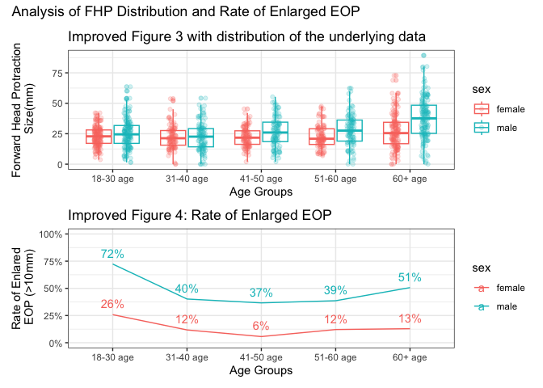
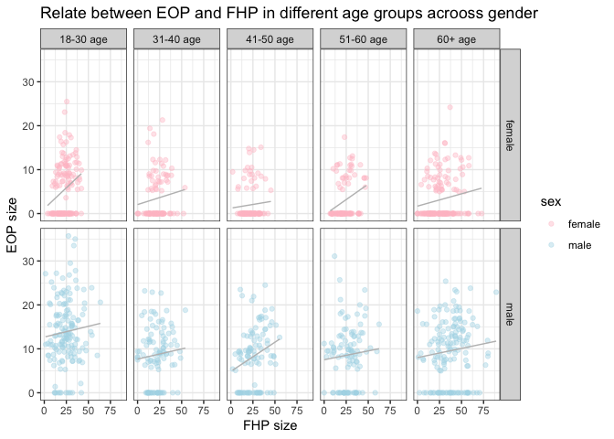

p8105_mtp_hc3654
================
Haohua Chen
2025-10-22

``` r
library(tidyverse)
```

    ## ── Attaching core tidyverse packages ──────────────────────── tidyverse 2.0.0 ──
    ## ✔ dplyr     1.1.4     ✔ readr     2.1.5
    ## ✔ forcats   1.0.0     ✔ stringr   1.5.1
    ## ✔ ggplot2   3.5.2     ✔ tibble    3.3.0
    ## ✔ lubridate 1.9.4     ✔ tidyr     1.3.1
    ## ✔ purrr     1.1.0     
    ## ── Conflicts ────────────────────────────────────────── tidyverse_conflicts() ──
    ## ✖ dplyr::filter() masks stats::filter()
    ## ✖ dplyr::lag()    masks stats::lag()
    ## ℹ Use the conflicted package (<http://conflicted.r-lib.org/>) to force all conflicts to become errors

``` r
library(readxl)
library(patchwork)
library(RColorBrewer)
library(scales)
```

    ## 
    ## Attaching package: 'scales'
    ## 
    ## The following object is masked from 'package:purrr':
    ## 
    ##     discard
    ## 
    ## The following object is masked from 'package:readr':
    ## 
    ##     col_factor

# Introduction

A controversial 2018 study linked poor neck posture (FHP) to skull bone
growths (EEOP), drawing widespread debate for its conclusion that the
condition was most common in young people. This report re-examines the
original data to verify these claims.

I will first detail the data cleaning process, then create improved
visualizations to correct flaws in the original paper’s figures.
Finally, I will check the accuracy of the author’s key statistics by
recalculating them directly from the dataset to determine if the
original conclusions are supported by the evidence.

# Problem 1

``` r
eop_df_raw <-  read_excel("p8105_mtp_data.xlsx", skip = 8, sheet = 1, na = c("NA",".", "")) |> 
  janitor::clean_names()
```

``` r
eop_df_clean <- eop_df_raw |> 
  mutate(
    sex = case_when(
      sex == 1 ~ "male",
      sex == 0 ~ "female"
    ), 
    sex = factor(sex),
    eop_size_mm = case_when(
      !is.na(eop_size_mm) ~ eop_size_mm,  
  is.na(eop_size_mm)  ~ 0
    ),

    age_group = case_when(
      age_group == 2 ~ "18-30 age",
      age_group == 3 ~"31-40 age" ,
      age_group == 4 ~ "41-50 age",
      age_group == 5 ~ "51-60 age",
      age_group %in% c(6,7,8) ~"60+ age"
    ),
    age_group = factor(age_group, 
                       levels = c("18-30 age", "31-40 age", "41-50 age", "51-60 age", "60+ age"),
                       ordered = TRUE),
    eop_size = case_when( 
      eop_size == 0 ~ "0-5mm eop size",
      eop_size == 1 ~ "5-10mm eop size",
      eop_size == 2 ~ "10-15mm eop size",
      eop_size == 3 ~ "15-20mm eop size",
      eop_size == 4 ~ "20-25mm eop size",
      eop_size == 5 ~ "25+mm eop size"
    ),
   eop_size = factor(eop_size,
                      levels = c("0-5mm eop size", "5-10mm eop size", "10-15mm eop size", "15-20mm eop size", "20-25mm eop size", "25+mm eop size"),
                      ordered = TRUE),
    eop_visibility_classification = case_when(
      eop_visibility_classification == 0 ~ "eop size 0mm",
      eop_visibility_classification == 1 ~ "0 < eop size mm <= 5",
      eop_visibility_classification == 2 ~ "eop size mm >= 5"
    ),
    eop_visibility_classification = factor(eop_visibility_classification),
    fhp_category = case_when(
      fhp_category == 0 ~ "0mm-10mm",
      fhp_category == 1 ~ "10mm-20mm",
      fhp_category == 2 ~ "20mm-30mm",
    ! (fhp_category %in% c(0, 1, 2)) ~ "other"
    ),
    fhp_category = factor(fhp_category)
    )

#group by sex and age
eop_df_clean |> 
  drop_na(age_group) |> 
  group_by(sex, age_group) |> 
  summarise(number = n()) |> 
  pivot_wider(
    names_from = age_group,
    values_from = number
  )
```

    ## `summarise()` has grouped output by 'sex'. You can override using the `.groups`
    ## argument.

    ## # A tibble: 2 × 6
    ## # Groups:   sex [2]
    ##   sex    `18-30 age` `31-40 age` `41-50 age` `51-60 age` `60+ age`
    ##   <fct>        <int>       <int>       <int>       <int>     <int>
    ## 1 female         151         102         106          99       155
    ## 2 male           152         102         101         101       150

Loaded the Excel file, skipping the 8 header rows. Used dplyr’s mutate()
and case_when() to clean the data and set ordered factors based on the
header info. The final dataset has 1221 participants. Key variables:
fhp_size_mm, eop_size_mm, sex, age_group. The distribution of sexes in
each age group is pretty similar: the ‘18-30 age’ and ‘60+ age’ groups
have about 150 people for each sex, while the other 3 groups have about
100 people for each sex.

``` r
# Check eop_size_mm and eop_size
eop_df_compare <- 
eop_df_clean |> 
  mutate(
    eop_size_check = case_when(
      eop_size_mm >= 0 & eop_size_mm <= 5 ~ "0-5mm eop size",
      eop_size_mm > 5 & eop_size_mm <= 10 ~ "5-10mm eop size",
      eop_size_mm > 10 & eop_size_mm <= 15 ~ "10-15mm eop size",
      eop_size_mm > 15 & eop_size_mm <= 20 ~ "15-20mm eop size",
      eop_size_mm > 20 & eop_size_mm <= 25 ~ "20-25mm eop size",
      eop_size_mm > 25 ~ "25+mm eop size"
    )) |> 
  filter(eop_size != eop_size_check) |> 
  select(sex, age, eop_size_mm, eop_size, eop_size_check)

eop_df_compare
```

    ## # A tibble: 20 × 5
    ##    sex      age eop_size_mm eop_size         eop_size_check  
    ##    <fct>  <dbl>       <dbl> <ord>            <chr>           
    ##  1 male      21       33.5  20-25mm eop size 25+mm eop size  
    ##  2 female    27       25.5  20-25mm eop size 25+mm eop size  
    ##  3 male      22       35    20-25mm eop size 25+mm eop size  
    ##  4 male      21       29.5  20-25mm eop size 25+mm eop size  
    ##  5 male      18        2.11 20-25mm eop size 0-5mm eop size  
    ##  6 male      74       15    15-20mm eop size 10-15mm eop size
    ##  7 male      38       15    15-20mm eop size 10-15mm eop size
    ##  8 male      53       31.1  20-25mm eop size 25+mm eop size  
    ##  9 male      24       35.7  20-25mm eop size 25+mm eop size  
    ## 10 male      64       25.4  20-25mm eop size 25+mm eop size  
    ## 11 male      23       26.8  20-25mm eop size 25+mm eop size  
    ## 12 male      48       23.5  25+mm eop size   20-25mm eop size
    ## 13 male      39       22.9  25+mm eop size   20-25mm eop size
    ## 14 female    28        0    5-10mm eop size  0-5mm eop size  
    ## 15 male      42       10    10-15mm eop size 5-10mm eop size 
    ## 16 male      61       14.6  15-20mm eop size 10-15mm eop size
    ## 17 female    64        5    5-10mm eop size  0-5mm eop size  
    ## 18 female    68        5    5-10mm eop size  0-5mm eop size  
    ## 19 male      61        5    5-10mm eop size  0-5mm eop size  
    ## 20 female    61       12.1  15-20mm eop size 10-15mm eop size

``` r
# Check age and age_group
age_compare <- 
eop_df_raw |> 
mutate(
age_group_check = case_when(
      age < 18 ~ 1,
      age >= 18 & age <= 30 ~ 2,
      age > 30 & age <= 40 ~ 3,
      age > 40 & age <= 50 ~ 4,
      age > 50 & age <= 60 ~ 5,
      age > 60 & age <= 70 ~ 6,
      age > 70 & age <= 90 ~ 7,
      age > 90 ~ 8,
    )
  ) |> 
  filter(age_group != age_group_check) |> 
  select(sex, age, age_group, age_group_check)

age_compare
```

    ## # A tibble: 2 × 4
    ##     sex   age age_group age_group_check
    ##   <dbl> <dbl> <chr>               <dbl>
    ## 1     1    45 1                       4
    ## 2     0    86 8                       7

``` r
# Check fhp_size_mm and fhp_category
inconsistent_fhp <- eop_df_clean |> 
  mutate(fhp_category_check = case_when(
      fhp_size_mm >= 0 & fhp_size_mm < 10 ~ "0mm-10mm",
      fhp_size_mm >= 10 & fhp_size_mm < 20 ~ "10mm-20mm",
      fhp_size_mm >= 20 & fhp_size_mm < 30 ~ "20mm-30mm",
      fhp_size_mm >= 30 ~ "other"
    )
  ) |> 
  filter(fhp_category != fhp_category_check) |> 
  select(sex, fhp_size_mm, fhp_category, fhp_category_check)

inconsistent_fhp
```

    ## # A tibble: 8 × 4
    ##   sex    fhp_size_mm fhp_category fhp_category_check
    ##   <fct>        <dbl> <fct>        <chr>             
    ## 1 female        21.1 10mm-20mm    20mm-30mm         
    ## 2 male          33.8 10mm-20mm    other             
    ## 3 male          22.9 10mm-20mm    20mm-30mm         
    ## 4 male          31.8 20mm-30mm    other             
    ## 5 male          30.1 10mm-20mm    other             
    ## 6 female        31.5 20mm-30mm    other             
    ## 7 female        27   10mm-20mm    20mm-30mm         
    ## 8 male          25   10mm-20mm    20mm-30mm

This process revealed widespread inconsistencies in the dataset’s
categorical variables. I found 20 errors in eop_size, 2 in age_group,
and 8 in fhp_category. Since in the raw dataset most of people in age
between in 70 - 80 is in Age group 7, so I will consider the 86 belong
to 7 is a mistake.

# Problem 2:

``` r
new_figured_3 <- 
eop_df_clean |> 
  drop_na(fhp_size_mm, age_group) |> 
  ggplot(aes(x = age_group, y = fhp_size_mm, color = sex))+
  geom_boxplot(alpha = 0.3)+
  geom_jitter(position = position_jitterdodge(dodge.width = 0.8, jitter.width = 0.2), alpha = 0.2)+
  labs(title="Improved Figure 3 with distribution of the underlying data", x = "Age Groups", y = "Forward Head Protraction\n Size(mm)")+
  theme_bw()
```

``` r
eeop_age_sex_rate <- 
eop_df_clean |> 
  drop_na(age_group, eop_size_mm, sex) |> 
  mutate(eeop = case_when(
    eop_size_mm > 10 ~ 1,
    eop_size_mm <= 10 ~ 0
  )) |> 
  select(sex, age_group, eop_size_mm, eeop) |> 
  group_by(age_group, sex) |> 
  summarise(eeop_rate = mean(eeop == 1, na.rm = TRUE), .groups = "drop")
eeop_age_sex_rate
```

    ## # A tibble: 10 × 3
    ##    age_group sex    eeop_rate
    ##    <ord>     <fct>      <dbl>
    ##  1 18-30 age female    0.258 
    ##  2 18-30 age male      0.724 
    ##  3 31-40 age female    0.118 
    ##  4 31-40 age male      0.402 
    ##  5 41-50 age female    0.0566
    ##  6 41-50 age male      0.366 
    ##  7 51-60 age female    0.121 
    ##  8 51-60 age male      0.386 
    ##  9 60+ age   female    0.129 
    ## 10 60+ age   male      0.507

``` r
new_figured_4 <- eeop_age_sex_rate |> 
  ggplot(aes(x = age_group, y = eeop_rate, fill = sex))+
  geom_bar(stat = "identity", position = "dodge", width = 0.7)+
  scale_y_continuous(labels = scales::percent) +
  labs(title = "Improved Figure 4: Rate of Enlarged EOP", 
       x = "Age Groups",
       y = "Rate of Enlared\n EOP (>10mm)")+
  theme_bw()


new_figured_4 <- eeop_age_sex_rate |> 
  ggplot(aes(x = age_group, y = eeop_rate, color = sex, group = sex))+
  geom_line()+
  geom_text(aes(label = percent(eeop_rate, accuracy = 1),
                vjust = -0.8,
                size = 3))+
  scale_y_continuous(labels = percent, limits = c(0, 1)) +
  labs(title = "Improved Figure 4: Rate of Enlarged EOP", 
       x = "Age Groups",
       y = "Rate of Enlared\n EOP (>10mm)")+
  theme_bw()
```

## Two Panels Figure

``` r
(new_figured_3/new_figured_4)+
   plot_annotation(
    title = "Analysis of FHP Distribution and Rate of Enlarged EOP")
```

<!-- -->

Panel A’s boxplots show FHP size, jitters shows distribution, which
increases slightly with age, is generally higher in males. Panel B
corrects a key error in the original paper, showing the Enlarged EOP
(EEOP) rate increases with age and is much higher in males,
contradicting the original conclusio

## 2 x 5 collection of panels

``` r
eop_df_clean |> 
  drop_na(fhp_size_mm, eop_size_mm, age_group, sex) |> 
  ggplot(aes(x = fhp_size_mm, y= eop_size_mm, color = sex))+
  geom_point( alpha = 0.4)+
  scale_color_manual(values = c("pink", "lightblue"))+
  geom_smooth(se = FALSE, color = "grey", linewidth = 0.5, method = "lm")+
  facet_grid(sex ~ age_group)+
  theme_bw()+
  labs(title = "Relate between EOP and FHP in different age groups acrooss gender", y = "EOP size", x= "FHP size")
```

    ## `geom_smooth()` using formula = 'y ~ x'

<!-- -->

Linear regression methods in the point graph to examine the relationship
between EOP and FHP size. The resulting trend lines indicate a clear
positive correlation across all sex and age groups, meaning as FHP size
increases, EOP size also tends to increase. It is also noteworthy that
more extreme EOP values are present in the 18-30 age group.

# Problem 3:

``` r
#among age group samples
eop_df_clean |> 
  drop_na(age_group) |> 
  group_by(age_group) |> 
  summarise(number = n()) |> 
  pivot_wider(
    names_from = age_group,
    values_from = number
    
  ) |> 
      knitr::kable( caption = "Among samples in each age")
```

| 18-30 age | 31-40 age | 41-50 age | 51-60 age | 60+ age |
|----------:|----------:|----------:|----------:|--------:|
|       303 |       204 |       207 |       200 |     305 |

Among samples in each age

Most of age_groups number is slightly different to author mentions in
article. 51-60 age is exact same.

``` r
#mean and sd of fhp
eop_df_clean |> 
  drop_na(fhp_size_mm,sex)|> 
  group_by(sex) |> 
  summarise(
    average_fhp = mean(fhp_size_mm), sd_fhp = sd(fhp_size_mm)
  ) |> 
  knitr::kable(col.names = c("Sex", "Mean", "SD"), caption = "Male and Female Statistic")
```

| Sex    |     Mean |       SD |
|:-------|---------:|---------:|
| female | 23.72580 | 10.61789 |
| male   | 28.51234 | 14.66670 |

Male and Female Statistic

The avarage fhp size for male and female is pretty close to the author
mentions in the article.

``` r
#cummlative prevalence 
eop_df_clean |> 
  drop_na(age_group, eop_size_mm, sex) |> 
  mutate(eeop = case_when(
    eop_size_mm > 10 ~ "Disease",
    eop_size_mm <= 10 ~ "No Disease"
  )) |> 
  select(sex, age_group, eop_size_mm, eeop) |> 
  group_by(eeop) |> 
  summarise(number = n()) |> 
  mutate(prevalence = number/ sum(number)) |> 
  mutate(value_pct = percent(prevalence, accuracy = 0.1) ) |>
  select(-prevalence) |> 
  knitr::kable(col.names = c("Category", "Person", "Prevalence(%)"), caption = "EEOP frequency")
```

| Category   | Person | Prevalence(%) |
|:-----------|-------:|:--------------|
| Disease    |    392 | 32.2%         |
| No Disease |    827 | 67.8%         |

EEOP frequency

Prevalence of EEOP is about 32.1% from dataset which close to the 33%
claimed by the author.

``` r
eop_df_clean |> 
  drop_na(age, age_group, fhp_size_mm, sex) |> 
  mutate(fhp_40 = case_when(
    fhp_size_mm > 40 ~ "FHP > 40 mm",
    fhp_size_mm <= 40 ~ "FHP <= 40 mm"
  )) |> 
  filter(age_group == "60+ age") |> 
  group_by(fhp_40) |> 
  summarise(number = n()) |> 
  mutate(fhp_freq = number / sum(number)) |> 
  mutate(value_pct = percent(fhp_freq, accuracy = 0.1) ) |>
  select(-fhp_freq) |> 
  knitr::kable(col.names = c("Category", "Person", "FHP_freq(%)"), caption = "60+ FHP size frequency")
```

| Category      | Person | FHP_freq(%) |
|:--------------|-------:|:------------|
| FHP \<= 40 mm |    205 | 67.4%       |
| FHP \> 40 mm  |     99 | 32.6%       |

60+ FHP size frequency

People older than 60 year old have fhp_size more than 40 mm is about
32.6% which slightly lower than 34.5% claimed by the author.

## Summary

My recalculation of the author’s statistics showed mixed results.

The mean FHP size and overall EEOP prevalence were largely reproducible
(32.1% vs. 33%). However, the reported sample sizes by age were mostly
incorrect, and another key statistic was slightly off (32.6% vs. 34.5%).

Overall, the paper’s broad statistics seem verifiable, but its details
are unreliable.
